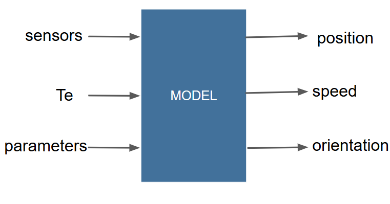

# Odometric model



This model needs as entries:
 - the two angles from the odometers of the car (in degrees)
 - the angle of the steering wheel (in radians)
 - the old value of x, y and theta, 
 - the sampling period
 - the wheels diameter and the length of the car
 
 Its outputs are:
 - the position (x and y) in meter
 - the speed (in m/s)
 - the orientation (in radians)

***

The calculation of the model is made through the file modelestep.py which needs to be called for each iteration of the model.

Different simulation-to-simulation tests can be compute with the file test.py. Thanks to them, we can check the consistency of the output of the model. 

Plot of XY chart and plot of Theta can be displayed by puttung the entries of the model in a entries.txt file and sending the command :
``` 
    python debugreal.py
```     