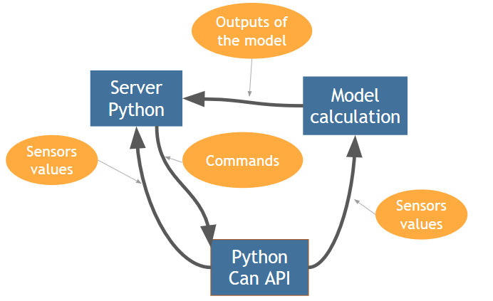

# Raspberry Pi



On the Raspberry Pi, 3 processes are running:
 * A CAN handler
    * Get the data from the can and send them to the web server and the calculation of the model
    * Send on the can the command from the HMI
    * Start the thread of the model
 * A web server
    * Display a HMI to control and get the value from the car and the model
    * Calculate the derivative of the difference of the two angles
 * A model
    * Calculate the model with the data from the cra
    * Send its outputs to the web server
    
On the client part of our HMI, a warning is displayed if the derivative calculed by the model is too high. It can then detect the type of problem depending of the value of the derivative of the angle from  the gyroscope.
The warning disappears when the car stops.
    
***

To launch the product, copy the CAN directory and the app directory on the Raspberry Pi. Then, copy the content of the model directory in the CAN directory.

Write the following command if this is the first time that you use the product:
``` 
    python3 CAN/setup.py
``` 

Then, write the following commands on the Raspberry Pi:
``` 
    python3 CAN/can_driver.py
    python app/server.py
```     
If the Raspberry Pi is a hotspot, any computer that is connected to its network can now reach the HMI on the port 8080 of the Raspberry Pi.